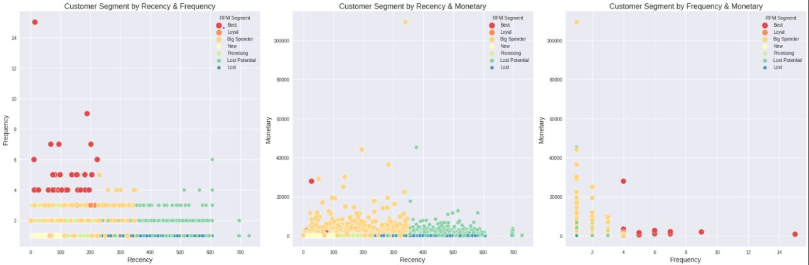

# Olist Customer Segmentation Based on Customer Behavior
Team Members:
* **Muhammad Ariq Budipraja** (muhammad.ariq15@gmail.com)
* **Rendi Salim** (rendisalim10@gmail.com)

## Table of Contents
* [Introduction](#introduction)
    * [Background](#background)
    * [Business Problem Statement](#problem-statement)
* [Data Understanding](#data-understanding)
* [Modeling](#modeling)
* [File Content](#file-content)
* [Reference](#reference)

## Introduction:
Project ini mengenai analisa dan customer segmentation berdasarkan transaksi behavior dari seorang customer

### Background:
Pada era teknologi saat ini, bisnis *E-commerce* merupakan hal umum yang dapat ditemukan. *E-commerce* sendiri adalah model bisnis yang memungkinkan sebuah perusahaan atau individu bisa membeli atau menjual produknya melalui internet. Pengguna *E-commerce* dari tiap tahunnya juga mengalami kenaikan, khususnya untuk negara Brazil. Berikut data pengguna *E-commerce* dari tahun 2017 - 2025.

Di dalam *E-commerce*, salah satu model bisnis yang dapat ditemukan adalah *marketplace*. *Marketplace* adalah model bisnis yang menyediakan tempat bertemunya seorang penjual dan pembeli. Salah satu contoh *marketplace* yang berada di Brazil adalah *Olist*. 

*Revenue* dari model bisnis *marketplace* bisa berasal dari fitur berbayar, iklan, payment gateway, dan partnership. Intinya semakin banyak *user* atau *trafic* pada suatu *marketplace* maka revenue yang didapatkan juga akan semakin banyak. Salah satu cara agar *user* atau *traffic* pada sebuah *marketplace* mengalami kenaikan adalah dengan adalah dengan melakukan *Marketing Campaign*, seperti pemberian *discount*, *copywriting*, dan lainnya. Pada umumnya, perusahaan menyiapkan budget sebesar 5%-12% dari total *revenue* yang didapatkan untuk melakukan *marketing campaign*. Namun, masalah yang terjadi adalah *marketing campaign* yang dilakukan tidak tepat sasaran sehingga perusahaan mengalami kerugian. Sebuah *marketing campaign* dapat dikatakan sukses bukan hanya diukur berdasarkan berapa banyak *user* baru yang berhasil didapatkan, melainkan juga berapa banyak *user* lama yang berhasil dipertahankan agar tetap menggunakan *marketplace* tersebut.  

 

Untuk mengatasi hal tersebut, salah satu cara yang dapat dilakukan adalah melakukan segmentasi pada *customer* atau yang biasa disebut dengan *Customer Segmentation*. *Customer Segmentation* membantu pemilik *marketplace* untuk mengelompokkan *customer* yang memiliki sifat yang sama. Dengan menggunakan *Customer Segmentation*, perusahaan dapat melakukan *marketing campaign* secara efektif sehingga jumlah transaksi *user* dan loyalitas *user* dapat meningkat. Menurut survey yang dilakukan oleh *Researchscape and Evergage* pada tahun 2020, 99% *marketer* setuju bahwa personalisasi membantu menguatkan hubungan dengan customer dan 78% dari hasil tersebut memberikan klaim bahwa *impact*-nya sangat kuat. 

 

### Business Problem Statement:
#### Business Problem Statement for Machine Learning?
**How to segment customers so we can divide customers based on their shopping behavior?**
* Value: Customer Segmentation
* Goals: Devide customers based on their shopping behavior

#### Business Problem Statement for Analytics?
* Value: Give treatment for each cluster
* Goals: Increase retention rate customer

## Data Understanding:
Berdasarkan *Problem Statement* yang ada di atas, kami akan menyelesaikan masalah yang dimiliki sebuah perusahaan *E-commerce* di Brazil, yaitu perusahaan *Olist*. Data ini diambil dari tahun 2016 - 2018 dan disebarkan secara public di <a href = "https://www.kaggle.com/olistbr/brazilian-ecommerce">Kaggle</a> pada tahun 2018 bulan September. Data-data yang ada berisi tentang transaksi *customer* dan *seller*. Untuk menyelesaikan masalah tersebut, kami hanya membutuhkan data-data yang berhubungan dengan transaksi *customer* saja karena yang ingin kami lakukan adalah *customer segmentation* yang berguna untuk mengetahui behavior seorang *customer* dalam bertransaksi. 

### Attribute Information:

## Modeling:
Pada bagian ini, kami feature yang kami gunakan adalah *Recency*, *Frequency*, dan *Monetary* dari *customer*. Ketiga hal tersebut dapat menggambarkan transaksi *behavior* dari seorang *customer*. Arti dari *RFM* sendiri adalah:
* *Recency*: Waktu terakhir kali *customer* melakukan pembelian
* *Frequency*: Jumlah transaksi
* *Monetary*: Kekuatan belanja dari sebuah *customer*
Model yang kami coba ada 3 model, yaitu RFM Segmentation, K-Means, dan Gaussian Models

### RFM Segmentation:
Pada RFM Segmentation, kami melakukan perhitungan skor segmentasinya dengan cara mengkombinasikan skor dari R, F, dan M menjadi sebuah kombinasi unik dalam bentuk string. Contohnya jika R = 1, F = 1, dan M = 1 maka RFM Segmentation Score nya menjadi 1 + 1 + 1 = 111 dan dari score tersebut kami memberikan segmentasi pada *customer*

#### Hasil dari RFM Segmentation:

### K-Means:
Dengan menggunakan feature RFM, kami menggunakan algoritma K-Means untuk melakukan *customer segmentation*

#### Hasil dari K-Means:

### Gaussians:
Model ini menggunakan gaussian method untuk membentuk suatu cluster.

#### Hasil dari Gaussians:

## File Content:
* Dataset: Folder yang berisi dataset dari [Kaggle]("https://www.kaggle.com/olistbr/brazilian-ecommerce")
* Img: Folder yang berisi gambar-gambar dari hasil project ini
* **data_outlist_clean.csv**: Data gabungan dari dataset
* **customer.csv**: Data transaksi behavior dari setiap customer
* **Part01-Cleaning-Data.ipynb**: Notebook file yang berisi bagaimana cara kami merge data, handling missing value, handling duplicate value, casting data type, handling inconsisten variable, dan save data menjadi dataset baru
* **Part02-EDA.ipynb**: Notebook file yang berisi EDA kami dan beberapa feature engineering untuk mendapatkan feature transaksi behavior dari seorang customer
* **Part03-Methodology(Data Analytics).ipynb**: Notebook file yang berisi Descriptive dan Inferential Analysis dari perusahaan *Olist*
* **Part04-Modeling.ipynbg**: Notebook file yang berisi model-model untuk *customer segmentation*

## Reference:
* [1] https://www.invespcro.com/blog/customer-acquisition-retention/
* [2] https://www.statista.com/forecasts/251659/e-commerce-users-in-brazil
* [3] https://clevertap.com/blog/rfm-analysis/
* [4] Prescription for Cutting Costs, Bain & Company
* [5] https://www.ngdata.com/how-to-improve-customer-retention/
